# Real Estate Panel — Use Case Diagram

```mermaid
graph TD
    %% Actors
    U(["👤 User"])
    A(["🔧 Admin"])

    %% ── Authentication ──────────────────────────────────────
    subgraph AUTH["Authentication"]
        UC1[Register]
        UC2[Login]
        UC3[Update Profile]
    end

    %% ── Properties ──────────────────────────────────────────
    subgraph PROP["Property Management"]
        UC4[Browse Properties]
        UC5[View Property Details]
        UC6[Create Property]
        UC7[Edit Property]
        UC8[Delete Property]
        UC9[Upload / Delete Images]
    end

    %% ── Requests ────────────────────────────────────────────
    subgraph REQ["Request Management"]
        UC10[Submit Buy / Rent Request]
        UC11[View My Requests]
        UC12[View All Requests]
        UC13[Approve Request]
        UC14[Reject Request]
    end

    %% ── Meetings ────────────────────────────────────────────
    subgraph MEET["Meeting Management"]
        UC15[View My Meetings]
        UC16[View All Meetings]
        UC17[Schedule Meeting]
        UC18[Complete Meeting]
        UC19[Cancel Meeting]
    end

    %% ── User associations ───────────────────────────────────
    U --> UC1
    U --> UC2
    U --> UC3
    U --> UC4
    U --> UC5
    U --> UC6
    U --> UC7
    U --> UC8
    U --> UC9
    U --> UC10
    U --> UC11
    U --> UC15

    %% ── Admin associations ──────────────────────────────────
    A --> UC2
    A --> UC3
    A --> UC4
    A --> UC5
    A --> UC9
    A --> UC12
    A --> UC13
    A --> UC14
    A --> UC16
    A --> UC17
    A --> UC18
    A --> UC19

    %% ── Include / Extend ────────────────────────────────────
    UC13 -->|"<<include>>"| UC17
```



## Actors

| Actor | Description |
|-------|-------------|
| **User** | Registered platform user — lists properties and submits buy/rent requests |
| **Admin** | Platform administrator — moderates requests and manages meetings |

## Use Cases Summary

| # | Use Case | User | Admin |
|---|----------|:----:|:-----:|
| 1 | Register | ✓ | — |
| 2 | Login | ✓ | ✓ |
| 3 | Update Profile | ✓ | ✓ |
| 4 | Browse Properties | ✓ | ✓ |
| 5 | View Property Details | ✓ | ✓ |
| 6 | Create Property | ✓ | — |
| 7 | Edit Property | ✓ (own) | — |
| 8 | Delete Property | ✓ (own, ACTIVE) | — |
| 9 | Upload / Delete Images | ✓ (own) | ✓ (any) |
| 10 | Submit Buy / Rent Request | ✓ | — |
| 11 | View My Requests | ✓ | — |
| 12 | View All Requests | — | ✓ |
| 13 | Approve Request | — | ✓ |
| 14 | Reject Request | — | ✓ |
| 15 | View My Meetings | ✓ | — |
| 16 | View All Meetings | — | ✓ |
| 17 | Schedule Meeting | — | ✓ (on approve) |
| 18 | Complete Meeting | — | ✓ |
| 19 | Cancel Meeting | — | ✓ |

> **Note:** Approving a request (`UC13`) automatically includes scheduling a meeting (`UC17`) — modelled as `<<include>>`.
```
